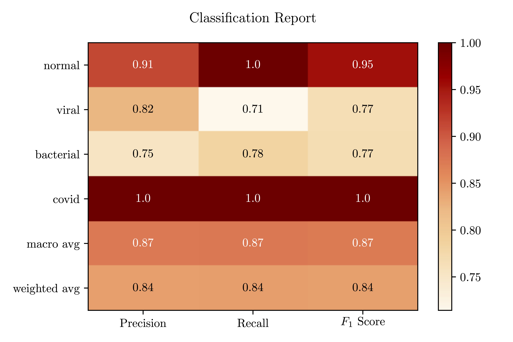
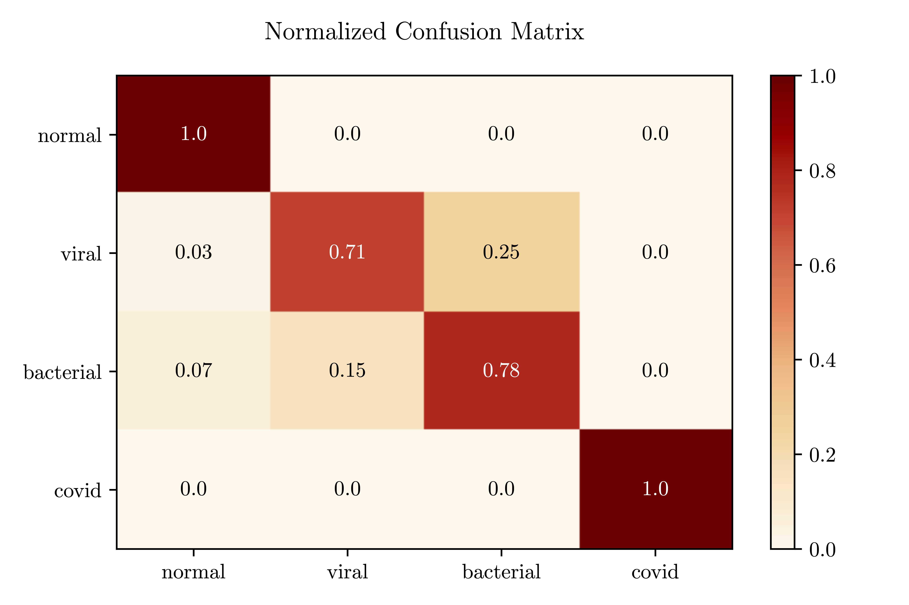

# COVID-19 Challenge

## Overview

This project is my participation in the Kaggle Competition of the class *Machine Learning* at Columbia University, taught by [Nakul Verma](http://www.cs.columbia.edu/~verma/). 

The aim of the competition was to diagnose patients with COVID-19, viral pneumonia, and bacterial pneumonia from images of chest X-rays.

## Data description

The training data includes 1127 chest X-rays drawn from several different sources (of varying size and quality) and a set of multiclass labels indicating whether each patient was healthy or diagnosed with bacterial pneumonia, viral pneumonia, or COVID-19. The test data includes 484 images without labels.

## Model

The model I used in this project are Neural Networks, build with [Keras](https://keras.io). I tried a hand-crafted one in a first time, and then used Transfer Learning on Resnet50V2.

## Setup

This project was made on Google Colab, to speed up the training of the NNs, but can be run without it. In that case, please ignore the first section of the notebook.

## Running the notebook

The notebook to be run is `C19_Challenge.ipynb`. You can simply run it cell by cell, from the start to the end. The only thing that needs to be changed is the paths used when importing/exporting data.

## Results

### On a holdout validation set

#### Training

(the vertical black line corresponds to the time I unfroze the lower weights during Transfer Learning)

#### Metrics

### On the test set

The formula used to compute the score on Kaggle was a weighted categorization accuracy, where correctly predicted COVID-19 images had a weight of 5, whereas the other classes had a weight of 1. 

My final score was 83,7% on the public test set, and 84.7% on the private test set.
